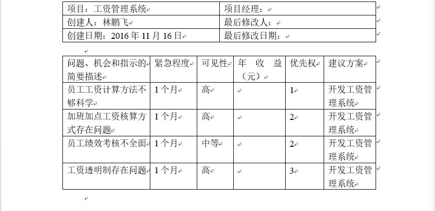

# 第二周进度报告
## 一、分工明确
### 1、林鹏飞：数据库构建、后台代码实现；
### 2、郭滕：后台管理界面修改；
### 3、王晨宇：前端页面（主页及登录页面）、MIS实验报告完善；

## 二、进展情况
### 1.前台页面基本完成；
### 2.完成数据库构建；
### 3.后台管理页面不断完善；

# 第一周进度报告
## 一、确定选题
### 确定小组项目选题：工资管理系统
### (1)基本思路
### 结合现行企业工资管理问题，设计一个工资管理系统，进行需求及问题分析，将前台、后台及数据库连接，实现一套工资管理解决方案。
### (2)作业目标
### 结合员工基本工资、职位工资、考核工资、绩效工资等工资类型，管理员工工资；系统包括查询、修改、添加、发放、打印工资报表等功能, 实现工### 的信息化管理。
## 二、范围定义
### 问题陈述

### 项目初步范围
### 1、系统数据：部门信息、员工信息、职位信息、考核信息、工资信息；
### 2、业务流程：查询员工信息、查询员工工资、工资结算、打印工资报表；
### 3、系统对象：员工、会计人员、技术人员、系统所有者、工资管理系统；
## 三、系统实现工作
### 1.后台代码框架
## 四、用例建模
### 1.用例图
### 2.部分用例描述
